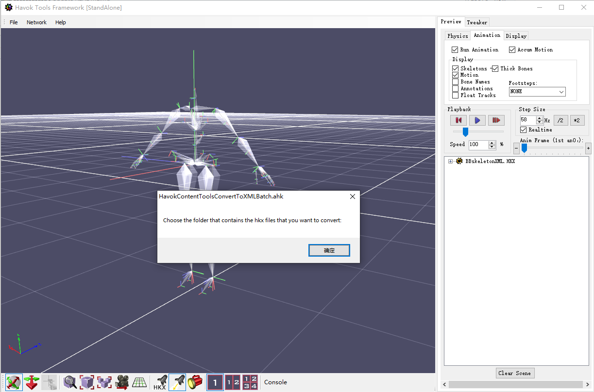
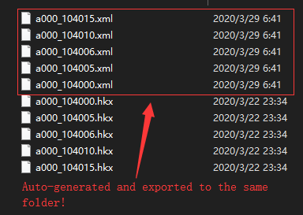

# HCT_Batch
HavokContentToolsBatcher---- An autohotkey script that allows you to massively convert your 64bit 2014 havoc .hkx file to xml version

# Tutorial

1. Run the script via autohotkey

2. Run the havoc content tools

3. [Ctrl + o] to open the folder choosing window

4. Have a cup of coffee / wait for all the files to be converted and saved to xml format.

5. Don't control your mouse/keyboard during this process, it may ruin the autohotkey workflow!

6. If you want to terminate the script in the middle of auto-processing, press ESC.
